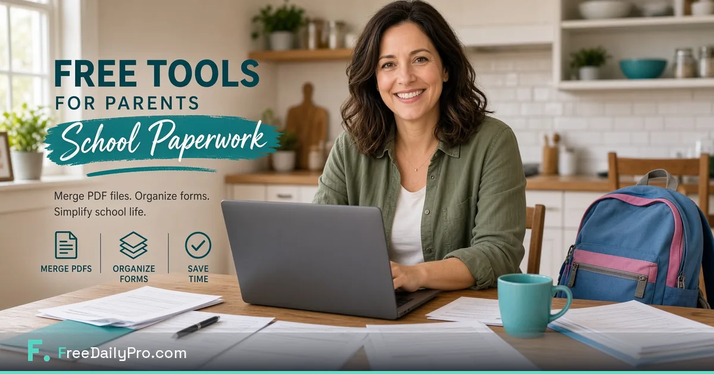

[FreeDailyPro.com](https://www.freedailypro.com) --  

School seasons arrive as PDF avalanches: permission slips, medical forms, lunch menus, sports waivers, and photo releases. Parents do not need another account for every form. They need free private tools that merge, compress, and organize packets without uploading family documents to random sites.

FreeDailyPro offers free browser PDF and image tools for this everyday stress. No login required for most everyday free use. Free daily allowance for normal volume. Client-side emphasis so core file work can stay on your device.

## Why school paperwork feels heavier than it should

Each form is small. Together they are chaos. Emails arrive from different teachers. Deadlines conflict. Someone uploads a birth certificate scan to a free converter just once. Free private tools reduce both the chaos and the risk.

## Free private school packet workflow

Download or scan forms. Compress phone photos of forms — https://www.freedailypro.com/tool/compress-image
Merge the week packet — https://www.freedailypro.com/tool/merge-pdf
Split if only one sport needs a waiver — https://www.freedailypro.com/tool/split-pdf
Compress for email — https://www.freedailypro.com/tool/compress-pdf
Star Favorites so next week is automatic.

## Medical and sensitive documents

Allergy lists, medication forms, and custody notes are highly sensitive. Prefer free tools that keep core processing in the browser. FreeDailyPro privacy-minded design helps families avoid careless uploads.

## Multiple kids, multiple schools

Name files Kid_School_Form_Date.pdf. Separate browser profiles can hold different Favorites. Language support helps multilingual households.

## PTA, coaches, and volunteers

Standardize free private merge and compress for team packets. Login-free everyday free use works on shared devices when policy allows.

## Pair with other free tools

Word Counter for long emails to teachers — https://www.freedailypro.com/tool/word-counter
Health calculators for rough personal orientation (not medical advice).
Moving tools if the school year coincides with relocation.

## Sunday night ritual

Fifteen minutes: merge open forms, compress, file in Submitted, star Favorites. Free private tools make the ritual short enough to keep.

## Free tier for family life

No login for most everyday free use. Free daily file uses. Day Pass during peak enrollment. Privacy stays default. Free tools should fit real households.

## Common parent mistakes

Angled phone photos never compressed. Thirty separate PDFs instead of one packet. Different free site every time. Passport scans to unknown compressors. No local copy after submit.

## Co-parents and caregivers

Share FreeDailyPro.com and a three-step checklist. Consistency matters more than perfection.

## Accessibility and print

Some schools still want paper. Compress and print clean packets. Free PDF tools avoid ink-wasting giant image-only scans.

## AI-policy and school networks

Devices may block cloud AI. Free browser PDF tools still work for form prep. FreeDailyPro stays useful when pasting private data into AI is unwise or blocked.

## What free tools cannot replace

Careful reading, medical requirements, and deadlines. They replace friction and risky uploads. That is still a large win.

## Enrollment season playbook

Checklist PDF of every form. Merge completed forms into Kid_Enrollment_2026.pdf. Compress. Submit. Archive. Free private tools make enrollment repeatable.

## Sports add-ons

Keep a master Sports_Waivers merge. Free split extracts only what today’s coach needs.

## Start this week’s packet privately

Open https://www.freedailypro.com/tool/merge-pdf, build one school packet, compress, send. What free family paperwork feature should we add next? Tell us.

Links: https://www.freedailypro.com · https://www.freedailypro.com/tool/merge-pdf · https://www.freedailypro.com/tool/compress-pdf · https://www.freedailypro.com/tool/split-pdf · https://www.freedailypro.com/tool/compress-image · https://www.freedailypro.com/tool/word-counter

## Digital backpack for the whole year

Create folders: Forms_Open, Forms_Submitted, Medical, Sports. Free private merge produces the packet that leaves Forms_Open. The system survives September chaos.

## Caregivers and grandparents

Write a one-page how-to: open FreeDailyPro, merge, compress, email. Free tools with no login for everyday use help less technical caregivers participate without new accounts.

## IEP and special education packets

These packets are sensitive and long. Free split helps share only relevant sections with specialists. Free compress keeps email workable. Privacy is not optional here.

## Summer program and camp paperwork

Camps mirror school form chaos. Reuse the same FreeDailyPro Favorites set. Free private tools transfer across seasons.

## Closing for parents

You are not failing at organization — the form system is noisy. Free private PDF tools on FreeDailyPro reduce the noise. Build one packet today and reclaim an evening this week.

Thank you for reading. Free school paperwork tools should protect family documents and reclaim Sunday nights.

## Extra practical notes for long-term use

Bookmark FreeDailyPro.com after your first successful job with these free tools. Star Favorites so the next project does not start from zero. Switch language if your clients or household prefer non-English labels. Free daily use covers normal volume; Day Pass helps peak weeks. Privacy for core file work stays client-side by design. Free tools, no login for most everyday use, AI-policy friendly for many workplaces — that stack is the point.

## How this differs from random free sites

Random free sites come and go, change paywalls, and often require uploads. FreeDailyPro is a permanent free toolkit bookmark with clear limits, optional Day Pass, and a privacy-minded approach for PDFs and images. That difference matters when you repeat the same workflow every week.

## Request for feedback

What free feature would remove one more weekly headache for you? Reply with the exact step that still forces you onto another site. FreeDailyPro improves fastest from specific friction reports after real tasks — not from generic feature wishlists.

Explore live free tools at https://www.freedailypro.com/tool/merge-pdf , https://www.freedailypro.com/tool/compress-pdf , https://www.freedailypro.com/tool/compress-image , and https://www.freedailypro.com/tool/word-counter . Use them in a real workflow this week and keep Favorites updated.

## FreeDailyPro promise in one paragraph

Free tools for daily work, no login required for most everyday use, client-side browser processing for core files, strong privacy emphasis, and AI-policy proof usefulness for many workplaces. Day Pass exists for heavy days without making privacy a paid feature. That is why FreeDailyPro.com belongs in your weekly bookmarks whether you shoot weddings, send proposals, manage school forms, or ship a solopreneur brand kit.

Live hub: https://www.freedailypro.com

Make free private school paperwork your household standard this semester — start with one packet tonight.
