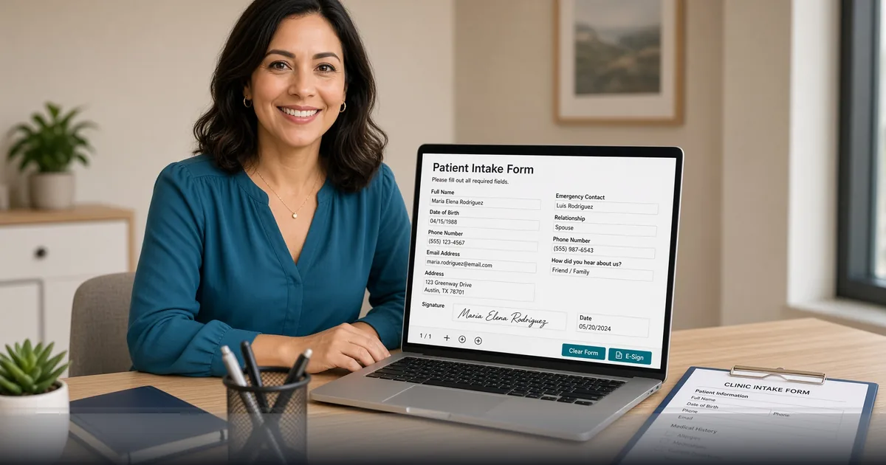

*Build free fillable PDFs and collect signatures in the browser without another form SaaS seat.*

[FreeDailyPro.com](https://www.freedailypro.com) --
Someone still asks you to print a PDF, sign it with a pen, photograph every page, and email a blurry stack back. That loop wastes hours and still looks unprofessional.

FreeDailyPro free [Fillable Forms](https://www.freedailypro.com/tool/fillable-forms) and [Signature PDF](https://www.freedailypro.com/tool/signature-pdf) help you turn static paperwork into fillable, signable files in a free browser workflow. No login required for most everyday free use. Core file work emphasizes client-side processing so documents stay closer to you.

## Why print-sign-scan still haunts teams

Email attachments age badly when every revision restarts the paper ritual. Free fillable forms remove the printer from the critical path for simple intake, permission, and acknowledgment packets.

You still need real legal review for high-stakes agreements. Free tools own the packaging layer: clearer fields, cleaner signatures, fewer photo-PDF disasters.

## The free private intake ritual

Start from your source PDF or convert with free Word/PDF tools on FreeDailyPro. Add fields with [Fillable Forms](https://www.freedailypro.com/tool/fillable-forms). Capture a signature path with [Signature PDF](https://www.freedailypro.com/tool/signature-pdf). Merge multi-page packs with [Merge PDF](https://www.freedailypro.com/tool/merge-pdf). Compress for email with [Compress PDF](https://www.freedailypro.com/tool/compress-pdf). Star Favorites before the next busy Monday.

## Who needs this every week

Clinics and coaches running intake. Freelancers collecting project kickoff forms. Schools and clubs handling permission slips. Small shops onboarding vendors. Anyone tired of illegible phone photos of wet-ink signatures.

## Privacy for personal data on forms

Forms often hold addresses, IDs, and health-adjacent admin. Prefer free tools that emphasize client-side processing for core files. FreeDailyPro free tools support that habit so sensitive drafts are not parked on random upload farms.

## What free fillable tools are not

They are not a full enterprise e-sign platform with audit trails for every regulated industry. They win at everyday intake and lightweight signature needs without a monthly form-builder bill.

## Quality checklist before you send

Fields tab in order. Required labels clear. Signature space large enough on mobile. File compressed. Filename includes version and date. Masters archived.

## AI-policy workplaces

Restricted networks still need paperwork to move. Free browser PDF tools keep intake alive when installers and unknown cloud form vendors are blocked.

## Pair with password and watermark when stakes rise

For drafts, stamp SAMPLE with [PDF Watermark](https://www.freedailypro.com/tool/pdf-watermark). For sensitive packs, lock with [Add PDF Password](https://www.freedailypro.com/tool/pdf-password). Free private tools on FreeDailyPro cover labeling and access control without Adobe.

## A practical standard for your team

Build the habit on a calm morning. Star Favorites. Keep masters local. Refuse random upload farms even when a deadline is loud.

FreeDailyPro free tools live in the middle layer of work: convert, label, lock, compress, track, generate — without demanding another permanent seat for a five-minute job.

Count the bounced portals, confused stakeholders, and emergency uploads to unknown free sites. Those should fall after Favorites becomes automatic.

Show a collaborator three tools only. Write the ritual in your notes. Free private tools scale through boring standards, not heroics.

When cloud AI is blocked, file prep still must happen. Free browser tools keep work moving on restricted laptops. FreeDailyPro is designed to stay useful under those constraints.

Main theme reminder: free tools, login free for most everyday use, client-side browser processing for core files, strong privacy emphasis, useful under strict AI policy.

Name files clearly. Version them. Archive masters. Delivery copies should be intentional.

Quiet weeks stay free. Seasonal spikes may need Day Pass for unlimited file tools. Privacy remains the default either way. Ads help keep free use sustainable.

## Practical next step this week

Pick one real file from your actual work. Run it through the free tools linked above. Star Favorites. Write down what still forced you onto another website. That single note is more valuable than a generic feature request.

Bookmark [https://www.freedailypro.com](https://www.freedailypro.com) and keep shipping with free private habits.

## Keep the bar high

Professional delivery is a habit. Free private browser tools keep that standard simple enough to repeat weekly without new accounts or mystery uploads.

## FreeDailyPro free tier honesty

No login required for most everyday free use. Free daily allowance covers normal file volume. Day Pass helps heavy days. Core file tools emphasize client-side browser processing so your files stay closer to you. Privacy is not a paid upgrade for that core work.

## What is coming next

Short videos will show exact clicks for the tools in this guide. Tell us which free step still forces you onto another site after a real job. FreeDailyPro improves fastest from specific friction reports.

## Mobile signing without chaos

Many signers open PDFs on phones. Keep signature fields large. Test one sample on a small screen before mass send. Free fillable and signature tools only help if the field is tappable.

## Version control for forms

Name files FormName_v3_2026-09-12.pdf. Retire old links. Free private tools make regeneration cheap so you never leave a broken field version in circulation.

## Training a VA in ten minutes

Show Fillable Forms once. Show Signature PDF once. Show compress once. Star Favorites. Free tools scale through simple standards, not long manuals.

## When paper is still required

Some offices still demand wet ink. Use free tools for the draft and internal routing, then print the final page that must be wet-signed. Hybrid workflows still save days.

## One more free private reminder

Free tools work best as bookmarks, not emergency searches. Star Favorites after your first success. When the next deadline arrives, the path is already there without feeding another random upload site.

If a free step still fails on a real file, tell FreeDailyPro what broke. Specific reports beat vague wishes. That is how free daily productivity stays honest.

Professional delivery is a habit. Free private browser tools keep that standard simple enough to repeat weekly.

## Call to action

Open [Fillable Forms](https://www.freedailypro.com/tool/fillable-forms) now, finish one real task today, and star Favorites so next week is automatic. Free private tools should remove friction — not create new accounts.

Which free feature should we improve next for your workflow? Share feedback — FreeDailyPro is built for free daily productivity with privacy at the core.

Thank you for reading. Free tools work best when they meet the work you already do.
