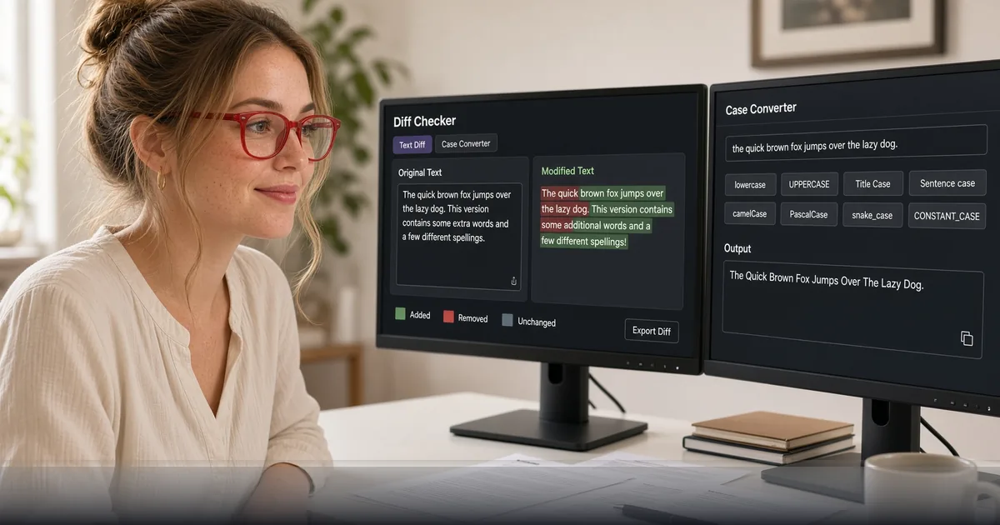

*Compare text versions free and fix casing fast — browser tools for editors, PMs, and freelancers.*

[FreeDailyPro.com](https://www.freedailypro.com) --
Two versions of the same copy. One silent change to a price, a date, or a legal phrase. If you rely on eyes alone, you will miss it under deadline pressure.

FreeDailyPro free [Diff Checker](https://www.freedailypro.com/tool/diff-checker) and [Case Converter](https://www.freedailypro.com/tool/case-converter) help you compare and normalize text quickly in the browser. Free everyday use. Login free for most free work.

## Why diffing is a professionalism habit

Clients rewrite in email. Teammates rewrite in docs. Free diffing turns “I think this changed” into a visible map of edits before you publish or sign.

## The free private editorial ritual

Paste or place versions into [Diff Checker](https://www.freedailypro.com/tool/diff-checker). Normalize titles and headings with [Case Converter](https://www.freedailypro.com/tool/case-converter). Count length with free word tools when needed. Package finals as PDF with free merge/compress. Star Favorites.

## Who benefits immediately

Freelance writers. Product marketers. PMs reviewing release notes. Students comparing drafts. Support teams updating macros.

## Privacy for unpublished copy

Drafts can include unreleased pricing and strategy. Prefer free browser utilities over pasting secrets into unknown web apps. FreeDailyPro free tools emphasize privacy-minded everyday utilities.

## What free diff tools are not

They are not full Git for binary design files. They win at text comparison and casing cleanup for human language work.

## Case converter without the busywork

Title Case, UPPER, lower — free conversion removes petty formatting fights so reviews focus on meaning.

## Close the loop with PDF delivery

After text is clean, ship a frozen PDF when stakeholders need a record. Free Excel/Word/PDF tools on FreeDailyPro complete the path from draft to delivery.

## A practical standard for your team

Build the habit on a calm morning. Star Favorites. Keep masters local. Refuse random upload farms even when a deadline is loud.

FreeDailyPro free tools live in the middle layer of work: convert, label, lock, compress, track, generate — without demanding another permanent seat for a five-minute job.

Count the bounced portals, confused stakeholders, and emergency uploads to unknown free sites. Those should fall after Favorites becomes automatic.

Show a collaborator three tools only. Write the ritual in your notes. Free private tools scale through boring standards, not heroics.

When cloud AI is blocked, file prep still must happen. Free browser tools keep work moving on restricted laptops. FreeDailyPro is designed to stay useful under those constraints.

Main theme reminder: free tools, login free for most everyday use, client-side browser processing for core files, strong privacy emphasis, useful under strict AI policy.

Name files clearly. Version them. Archive masters. Delivery copies should be intentional.

Quiet weeks stay free. Seasonal spikes may need Day Pass for unlimited file tools. Privacy remains the default either way. Ads help keep free use sustainable.

## Practical next step this week

Pick one real file from your actual work. Run it through the free tools linked above. Star Favorites. Write down what still forced you onto another website. That single note is more valuable than a generic feature request.

Bookmark [https://www.freedailypro.com](https://www.freedailypro.com) and keep shipping with free private habits.

## Keep the bar high

Professional delivery is a habit. Free private browser tools keep that standard simple enough to repeat weekly without new accounts or mystery uploads.

## FreeDailyPro free tier honesty

No login required for most everyday free use. Free daily allowance covers normal file volume. Day Pass helps heavy days. Core file tools emphasize client-side browser processing so your files stay closer to you. Privacy is not a paid upgrade for that core work.

## What is coming next

Short videos will show exact clicks for the tools in this guide. Tell us which free step still forces you onto another site after a real job. FreeDailyPro improves fastest from specific friction reports.

## Client email rewrites

Paste the email version vs the doc version. Free diffing catches silent scope changes before you agree.

## Localization casing traps

Title Case rules differ by language. Free converters help English ops; human editors still own locale nuance.

## Release note hygiene

Diff last week vs this week before publishing. Free tools reduce “what changed?” threads.

## Pair with word count

After edits, check length for UI microcopy and ads. Free word tools on FreeDailyPro pair well with diffing.

## One more free private reminder

Free tools work best as bookmarks, not emergency searches. Star Favorites after your first success. When the next deadline arrives, the path is already there without feeding another random upload site.

If a free step still fails on a real file, tell FreeDailyPro what broke. Specific reports beat vague wishes. That is how free daily productivity stays honest.

Professional delivery is a habit. Free private browser tools keep that standard simple enough to repeat weekly.

## Field notes from real operators

The free path only works when it survives a messy Tuesday. Save Favorites. Keep a short checklist in your notes app. Refuse to re-learn a random converter under pressure.

FreeDailyPro free tools are built for that messy Tuesday: login free for most everyday use, client-side emphasis for core file work, privacy-minded defaults, and usefulness when company AI policy is strict.

If your team still loses an hour to print-sign-scan, oversharing PDFs, broken tabs, silent copy edits, or format dead-ends, the fix is usually a boring free ritual — not another annual SaaS seat.

Ship one improved pack this week. Measure the minutes saved. Then make the ritual default.

## Closing standard

Decide once that this job uses FreeDailyPro free tools. Teach Favorites. Review quarterly. Free private habits upgrade professionalism more than a new logo.

Live hub: [https://www.freedailypro.com](https://www.freedailypro.com). Start with one real file today.

## Call to action

Open [Diff Checker](https://www.freedailypro.com/tool/diff-checker) now, finish one real task today, and star Favorites so next week is automatic. Free private tools should remove friction — not create new accounts.

Which free feature should we improve next for your workflow? Share feedback — FreeDailyPro is built for free daily productivity with privacy at the core.

Thank you for reading. Free tools work best when they meet the work you already do.
