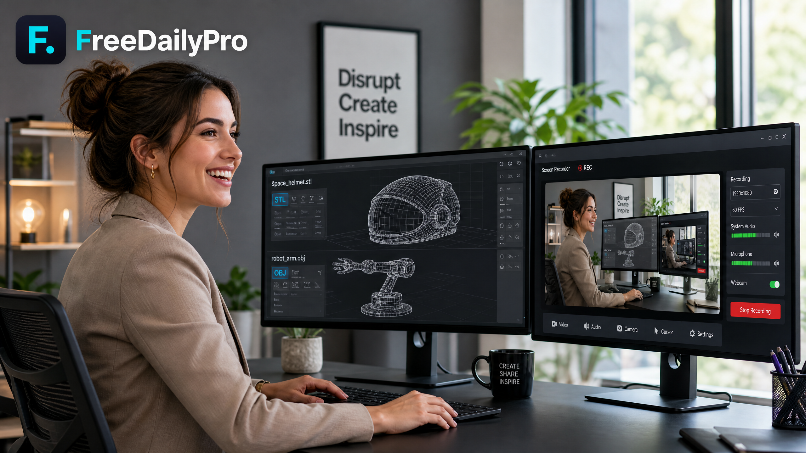

# Unlock Your Creative Power: Free 3D File Converters and Lightning-Fast Screen Recording!

*Discover the ultimate productivity upgrade for creators, designers, and professionals with our brand-new, completely free suite of tools designed to elevate your digital workflow. Whether you are prepping complex STL, OBJ, and PLY files for seamless 3D printing and precision CAD projects, or capturing crystal-clear screen recordings and instant screenshots without annoying watermarks, FreeDailyPro has you covered. Enjoy lightning-fast local processing that keeps your sensitive designs and personal recordings completely private, outperforming expensive subscription-based and cloud-dependent AI tools that risk your data security. Save hundreds of dollars every year while retaining total control over your digital assets. Dive in today to explore how these powerhouse utilities can transform your creative output, streamline your daily tasks, and empower your workflow like never before.*

[FreeDailyPro.com](https://freedailypro.com) -- Are you tired of watching your creative momentum grind to a halt because of expensive software subscriptions and locked-behind-paywall tools? 

Imagine having instant access to professional-grade utilities right in your browser, completely free of charge. 

Today, we are thrilled to roll out our newest powerhouse utilities: advanced 3D file converters and a lightning-fast screen recorder!

Whether you are an engineer working on CAD designs or a hobbyist prepping models for 3D printing, our tools make your life easier.

Let's dive into how these additions can supercharge your daily workflow.

[Future Video Embed Placeholder]

Navigating the world of 3D printing often feels like running an obstacle course of incompatible formats. 

You find the perfect model, only to realize it is in the wrong format for your slicer software. 

Our new converters handle STL, OBJ, and PLY files with absolute ease and remarkable speed. 

You no longer need to worry about complex software installations or tedious file corruption errors. 

Transform your designs instantly and get your prints started faster than ever before.

Beyond 3D modeling, capturing what happens on your screen should never be a complicated chore. 

Our brand-new screen recorder and screenshot tool has been on our wishlist since day one. 

Capture high-definition tutorials, gameplay highlights, or bug reports with just a single click. 

No frustrating watermarks, no hidden fees, and absolutely no complicated setup processes required. 

It is clean, reliable, and built specifically for creators who value their precious time.

You might wonder how these free tools stack up against flashy AI-driven alternatives flooding the market today. 

Many AI-powered utilities demand hefty monthly subscriptions and route your sensitive files through external cloud servers. 

That means your proprietary designs and personal screen captures are exposed to third-party data collection risks. 

Our tools perform secure local processing, ensuring your creative work stays entirely private and protected. 

By keeping your data on your device, you save money while enjoying bulletproof privacy that cloud giants cannot match.

We want to make sure these tools evolve to fit your exact needs and creative ambitions. 

What additional features or specialized converters would you love to see on [FreeDailyPro.com](https://freedailypro.com) next? 

Drop your thoughts in the comments below or reach out to our team to help shape our future roadmap. 

Head over to our [Tools Page](https://freedailypro.com/tools) right now to try out the new converters and screen recorder!

---
**One-liner:** Unlock free 3D file converters (STL, OBJ, PLY) and a real screen recorder to boost productivity and protect your privacy today!

**Tags:** 3D printing, STL converter, OBJ converter, PLY converter, screen recorder, screenshot tool, CAD tools, free utilities, digital creation, workflow optimization, privacy protection, FreeDailyPro
