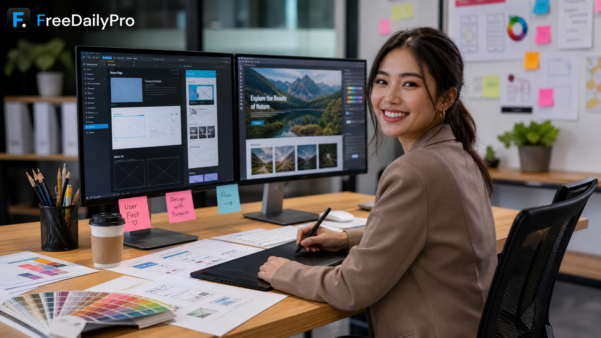

# Stop Struggling With Site Maintenance: Discover Free Web Design Tools That Save You Money and Protect Your Privacy!

*Unlock the ultimate secret to effortless website management with our comprehensive guide to free web design tools, featuring instant color palette generators, lightning-fast image optimizers, and custom favicon creators that empower creators to build breathtaking digital experiences without spending a single dime or compromising valuable personal privacy and data security.*

[FreeDailyPro.com](https://freedailypro.com) -- Are you tired of spending hours wrestling with complex software, costly subscriptions, and frustrating site maintenance tasks just to keep your web design projects running smoothly? You are definitely not alone! Building and maintaining a stunning website should feel exciting and empowering, not like an endless chore.

Imagine having a powerhouse collection of lightning-fast, secure tools right at your fingertips that handle everything from gorgeous color palettes and image optimization to crisp favicons instantly. When you use free, browser-based utilities, you maintain total ownership and privacy of your data without risking third-party tracking or mandatory server uploads. 

Unlike heavy AI-based tools that often lock basic features behind expensive paywalls or harvest your proprietary design data, our free utilities run locally or securely without compromising your personal privacy. You save your hard-earned money while enjoying complete control over every single pixel of your creative digital masterpieces!

Let us explore how you can streamline your workflow today. First, check out our [Color Palette Generator](https://freedailypro.com) to instantly harmonize your brand tones. Next, use our [Image Optimizer](https://freedailypro.com) to lightning-speed your page loads, and wrap up with our [Favicon Creator](https://freedailypro.com) for that flawless professional touch.

[Future Video Embed Placeholder]

We love building these incredible resources specifically for passionate creators like you. What specific web design feature or maintenance tool would you love to see next on [FreeDailyPro.com](https://freedailypro.com)? Drop your brilliant feedback below and help us shape the ultimate toolkit for your digital success!

---
**One-liner:** Master web design and site maintenance with free tools that save money, protect your data, and elevate your creative workflow instantly!

**Tags:** web design, site maintenance, free tools, color palette, image optimization, favicon generator, data privacy, web developer, productivity
