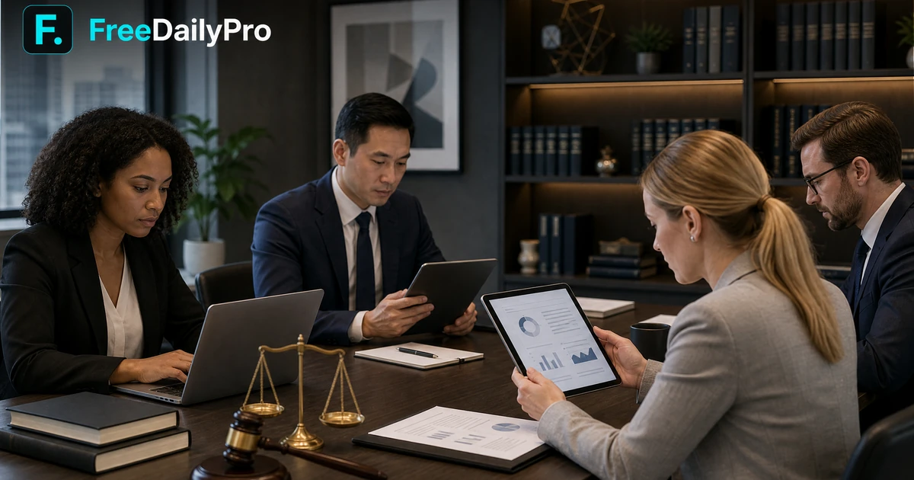

# Never Pay a Lawyer Again: How to Draft Your Own NDA, Lease Agreement, and Power of Attorney for Free

*Navigating legal documents can often feel like walking through an expensive minefield where every misstep costs hundreds of dollars in legal fees. Whether you are launching a startup and need a rock-solid Non-Disclosure Agreement, renting out your first property with a comprehensive lease agreement, or securing your family's future through a legally sound Power of Attorney, the barrier to entry has traditionally been financial. People routinely assume that custom legal protection requires a retainer, a specialized attorney, or expensive software subscriptions that drain resources before a venture even begins. However, the digital landscape has transformed, and professional-grade legal documentation is now accessible to everyone without spending a dime. By leveraging smart digital tools, standardized templates, and meticulous attention to detail, you can take control of your legal paperwork, protect your assets, and ensure compliance without ever stepping foot in a high-priced law office. This guide explores how you can draft, convert, and finalize essential legal documents entirely for free, empowering you to safeguard your personal and professional interests with absolute confidence and zero overhead.*

*Navigating legal documents can often feel like walking through an expensive minefield where every misstep costs hundreds of dollars in legal fees. Whether you are launching a startup and need a rock-solid Non-Disclosure Agreement, renting out your first property with a comprehensive lease agreement, or securing your family's future through a legally sound Power of Attorney, the barrier to entry has traditionally been financial. People routinely assume that custom legal protection requires a retainer, a specialized attorney, or expensive software subscriptions that drain resources before a venture even begins. However, the digital landscape has transformed, and professional-grade legal documentation is now accessible to everyone without spending a dime. By leveraging smart digital tools, standardized templates, and meticulous attention to detail, you can take control of your legal paperwork, protect your assets, and ensure compliance without ever stepping foot in a high-priced law office. This guide explores how you can draft, convert, and finalize essential legal documents entirely for free, empowering you to safeguard your personal and professional interests with absolute confidence and zero overhead.*

[FreeDailyPro.com](https://freedailypro.com) -- When it comes to protecting your intellectual property, managing real estate, or planning for life's unpredictability, having the right legal documents in place is non-negotiable. Yet, the traditional legal advice model often penalizes individuals and small business owners with exorbitant hourly rates. Fortunately, you can bypass these costs by understanding the core components of essential legal agreements and utilizing free online resources to prepare them yourself.

## Demystifying the Non-Disclosure Agreement (NDA)

An NDA is the cornerstone of modern business collaboration. Whether you are pitching a revolutionary app idea to developers, discussing a partnership with investors, or hiring freelance contractors, an NDA ensures your sensitive information remains confidential. 

To draft an effective NDA, you must clearly define what constitutes confidential information, specify the duration of the agreement, and outline the remedies available in case of a breach. Once your document is drafted, you may need to convert your text files into secure PDF formats before sharing them with stakeholders. You can effortlessly [Convert PDF](https://freedailypro.com/tool/convert-pdf) to ensure compatibility across all devices. Furthermore, if you are working with multiple scanned pages or reference documents, use the [Merge PDF](https://freedailypro.com/tool/merge-pdf) utility to combine everything into a single, cohesive file.

## Crafting a Bulletproof Lease Agreement

Entering the rental market as a landlord or a tenant comes with significant responsibilities. A comprehensive lease agreement protects both parties by detailing rent amounts, security deposit terms, maintenance obligations, and termination clauses. 

Drafting a lease doesn't require expensive legal templates. By utilizing standard, legally vetted clauses, you can create a customized lease that complies with local housing laws. When dealing with large lease packets that exceed email attachment limits, you can easily [Compress PDF](https://freedailypro.com/tool/compress-pdf) to reduce file size without losing a single word of critical text. Additionally, if you need to extract specific signature pages or split a multi-document agreement, the [Split PDF](https://freedailypro.com/tool/split-pdf) tool provides a fast, hassle-free solution.

## Securing Your Future with a Power of Attorney (POA)

A Power of Attorney is one of the most critical estate planning documents you will ever create. It grants a trusted individual the authority to make financial, legal, or medical decisions on your behalf if you become incapacitated. 

Because a POA deals with profound legal authority, precision is paramount. You must clearly define the scope of powers granted—whether general or limited—and ensure the document is properly witnessed and notarized according to your jurisdiction's requirements. To organize your supporting financial statements and identification records into clean, uniform archives before final submission, you can rely on the [Image to PDF](https://freedailypro.com/tool/image-to-pdf) converter.

## Conclusion

Taking charge of your legal documents is an empowering step toward financial and professional independence. By understanding the fundamentals of NDAs, lease agreements, and Powers of Attorney, and by leveraging professional digital tools to manage your files, you save both money and time. 

***

**Tags:** Legal Documents, NDA, Lease Agreement, Power of Attorney, Free Legal Tools, Small Business, Personal Finance

**One-liner:** Empower yourself with free, professional-grade legal documents and digital file management tools to protect your assets without paying expensive lawyer fees.

**Video Placeholder:** `[Embedded Video: Step-by-Step Tutorial on Drafting Free Legal Documents - Watch Here]`
